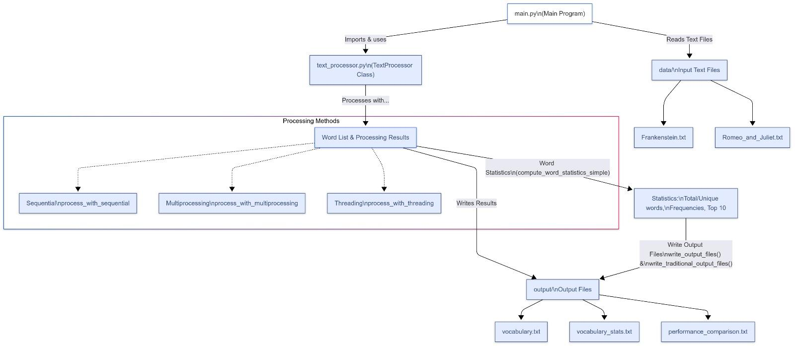

# Text Processing with Concurrent Programming 🚀

A comprehensive Operating System project demonstrating advanced concurrent programming techniques for text processing and analysis. This project implements and compares different concurrency approaches (Sequential, Threading, and Multiprocessing) to process large text files and compute word statistics efficiently.

[](https://choosealicense.com/licenses/mit/)
[](https://www.python.org/downloads/)

## 📋 Table of Contents

- [Overview](#overview)
- [Features](#features)
- [Architecture](#architecture)
- [Installation](#installation)
- [Usage](#usage)
- [Performance Analysis](#performance-analysis)
- [Project Structure](#project-structure)
- [Technical Details](#technical-details)
- [Future Enhancements](#future-enhancements)
- [Contributing](#contributing)
- [License](#license)

## 🎯 Overview

This project demonstrates the implementation of concurrent programming techniques for automatic text processing and analysis. It processes multiple text files, extracts vocabulary, computes word frequencies, and generates detailed statistical reports.

The system is designed for Natural Language Processing (NLP) applications and training linguistic models, showcasing:

- **Multiprocessing**: Parallel processing with separate processes and memory spaces
- **Threading**: Concurrent processing with shared memory within a single process
- **Sequential Processing**: Traditional single-threaded approach for baseline comparison

## ✨ Features

### Core Capabilities

- 📁 **Multi-file Processing**: Scan and process multiple text files simultaneously
- 🧹 **Text Cleaning**: Automatic removal of punctuation, digits, and non-alphabetic characters
- 📊 **Word Statistics**: Comprehensive analysis including frequency counts and top words
- ⚡ **Performance Comparison**: Detailed benchmarking of different concurrency approaches
- 📝 **Automated Reporting**: Generate vocabulary lists, statistics, and performance reports

### Processing Methods

1. **Sequential Processing**: Traditional single-threaded approach
2. **Threading**: Concurrent processing optimized for I/O-bound operations
3. **Multiprocessing**: Parallel processing optimized for CPU-intensive tasks

## 🏗️ Architecture

The project follows a modular architecture with clear separation of concerns:


### File Structure

```
Operating-System-Project/
├── main.py                    # Main execution script
├── text_processor.py          # Text processing engine
├── data/                      # Input text files
│   ├── Frankenstein.txt
│   └── Romeo_and_Juliet.txt
├── output/                    # Generated reports
│   ├── vocabulary.txt
│   ├── vocabulary_stats.txt
│   └── performance_comparison.txt
└── images/                    # Documentation images
```

## 🚀 Installation

### Prerequisites

- Python 3.7 or higher
- Standard Python libraries (no external dependencies required!)

### Setup

1. **Clone the repository**
   ```bash
   git clone https://github.com/MariaNakhle/Operating-System-Project-.git
   cd Operating-System-Project-
   ```

2. **Verify Python installation**
   ```bash
   python --version
   ```

3. **Add your text files** (optional)
   - Place `.txt` files in the `data/` directory
   - The project includes sample files: Frankenstein and Romeo & Juliet

## 💻 Usage

### Basic Execution

Run the main script to process all text files and generate reports:

```bash
python main.py
```

### Expected Output

The program will:

1. Process files using three different methods
2. Display real-time progress and timing information
3. Generate comprehensive statistics
4. Create output files in the `output/` directory

### Sample Output

```
============================================================
TEXT PROCESSING WITH CONCURRENCY COMPARISON
============================================================

Processing files using different concurrency approaches...

1. Testing Sequential Processing...
    Completed in 0.0478 seconds
    Processed 104,497 words

2. Testing Multiprocessing...
    Completed in 0.2298 seconds
    Processed 104,497 words

3. Testing Threading...
    Completed in 0.0349 seconds
    Processed 104,497 words

FINAL RESULTS:
--------------------
Total words: 104,497
Unique words: 12,458
Statistics computed using: threading

Top 10 most common words:
   1. the          : 4,196
   2. and          : 2,876
   3. i            : 2,666
   4. to           : 2,540
   5. of           : 2,445
   ...
```

## 📊 Performance Analysis

### Methodology

- **Identical Input**: All methods process the same text files
- **Precise Timing**: Measuring both total and pure processing time
- **Detailed Logging**: Recording every operation with timestamps
- **Multiple Runs**: Repeated testing for consistent results

### Benchmark Results



Processing performance on a 4-core CPU with 104,497 words:

| Method           | Time (seconds) | Performance | Best For           |
|------------------|----------------|-------------|--------------------|
| **Threading**    | 0.0349         | **Fastest** | I/O-bound tasks    |
| Sequential       | 0.0478         | 37% slower  | Simple operations  |
| Multiprocessing  | 0.2298         | 558% slower | CPU-intensive tasks|

### Output Files


1. **vocabulary.txt**: Alphabetically sorted unique words
2. **vocabulary_stats.txt**: Statistical summary with top 10 words
3. **performance_comparison.txt**: Detailed performance metrics

### Key Findings

#### Threading (Winner for this use case)
- ✅ **Fastest execution** for I/O-bound file operations
- ✅ Efficient memory sharing between threads
- ✅ Low overhead compared to multiprocessing
- ✅ Ideal for reading multiple text files

#### Sequential Processing
- ✅ Simple and easy to understand
- ✅ No concurrency overhead
- ✅ Suitable for small datasets
- ⚠️ Limited scalability

#### Multiprocessing
- ⚠️ Higher overhead due to process creation
- ⚠️ Inter-process communication costs
- ✅ Excellent for CPU-intensive computations
- ✅ Better for very large datasets with heavy processing

## 🔧 Technical Details

### Text Processing Pipeline

1. **File Reading**: UTF-8 encoding with error handling
2. **Text Cleaning**:
   - Convert to lowercase
   - Remove punctuation and digits
   - Filter non-alphabetic words
3. **Word Counting**: Efficient dictionary-based counting
4. **Statistics Computation**: Frequency analysis and ranking
5. **Report Generation**: Multiple output formats

### Concurrency Implementation

#### Threading Approach
```python
def process_with_threading(folder_path):
    threads = []
    for filepath in filepaths:
        thread = threading.Thread(target=worker, args=(filepath,))
        threads.append(thread)
        thread.start()
    
    for thread in threads:
        thread.join()
```

#### Multiprocessing Approach
```python
def process_with_multiprocessing(folder_path):
    with multiprocessing.Pool(4) as pool:
        results = pool.map(read_and_clean_file_standalone, filepaths)
```

### Synchronization

- **Thread Locks**: Prevent race conditions during shared data access
- **Process Pools**: Manage worker processes efficiently
- **Result Merging**: Combine results from parallel workers

## 🔮 Future Enhancements

1. **File Chunking**: Split very large files into smaller segments
2. **Memory Monitoring**: Track and optimize memory usage
3. **Network Processing**: Support for distributed file processing
4. **GUI Interface**: Add graphical user interface for easier interaction
5. **Language Support**: Extend to multiple languages beyond English
6. **Real-time Processing**: Stream processing for live text analysis
7. **Advanced NLP**: Add stemming, lemmatization, and sentiment analysis

## 👥 Contributing

Contributions are welcome! Please feel free to submit a Pull Request.

## 📄 License

This project is licensed under the MIT License - see the [LICENSE](LICENSE) file for details.

## 👨‍💻 Authors

- **Maria Nakhle** - 207716762
- **Tatiana Abu Shakara** - 212581037

**Supervised by**: Rafael Shalala

---

**Course**: Operating Systems (31261)  
**Semester**: Spring 2025

## 🙏 Acknowledgments

- Sample texts from Project Gutenberg (Frankenstein, Romeo and Juliet)
- Python multiprocessing and threading documentation
- Operating Systems course materials

---

Made with ❤️ for the Operating Systems course
